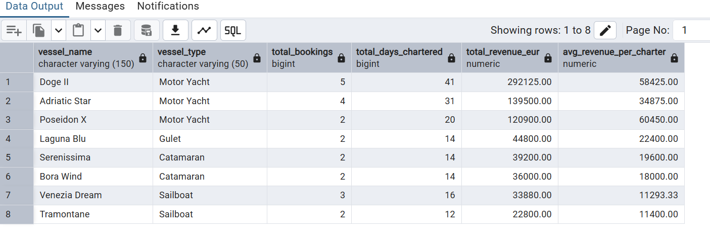
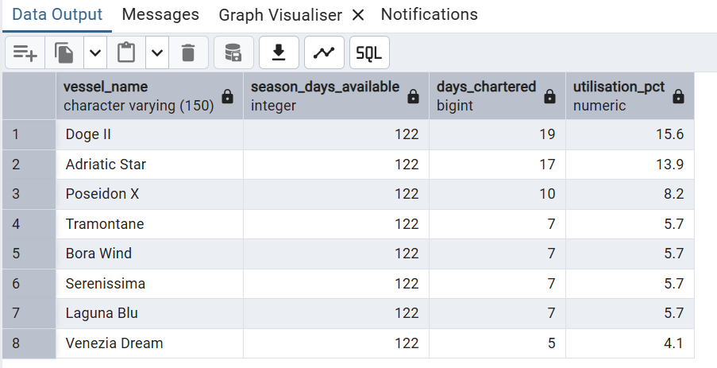
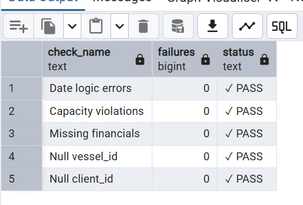

# Acquera Yachting — Data Platform

A PostgreSQL data platform built to model the core operations of a yacht charter business.

The project covers the full data lifecycle: schema design, data ingestion, analytical queries, and automated quality checks — structured to support dashboards and internal reporting.

---

## What's Inside

```
acquera-data-platform/
├── sql/
│   ├── 01_schema.sql             # Tables, indexes, views
│   ├── 02_seed_data.sql          # ~200 rows across 6 tables
│   ├── 03_analytics_queries.sql  # 13 business queries
│   └── 04_data_quality.sql       # 8 automated DQ checks
└── screenshots/
    ├── revenue_by_vessel.png
    ├── fleet_utilisation.png
    └── dq_health_check.png
```

---

## Data Model

Six tables covering the core operations of a charter business.

```
ports ──────────────────────────────────────┐
vessels ──────────────────────────────────┐  │
                                          ↓  ↓
clients ──────────────────────────── bookings
                                          │
                               ┌──────────┴──────────┐
                               ↓                     ↓
                          financials        crew_assignments
```

| Table | What It Stores |
|---|---|
| `ports` | Departure and arrival locations across the Med |
| `vessels` | Fleet master data — type, capacity, daily rate |
| `clients` | Individual, broker, and corporate clients |
| `bookings` | One row per charter — the central fact table |
| `financials` | Revenue, costs, commissions per booking |
| `crew_assignments` | Crew members and day rates per charter |

---

## Analytics Built

**Commercial**
- Revenue by vessel, vessel type, season, and year
- Year-on-year growth (2023 vs 2024)
- Client segmentation — VIP, Repeat, One-time
- Acquisition channel performance (direct vs broker vs online)

**Operational**
- Fleet utilisation — days chartered vs days available per season
- Booking lead time by vessel type
- Popular routes and destination pairs
- Double-booking detection

**Financial**
- Gross margin per booking after crew, ops costs, and commissions
- Commission split by acquisition channel
- Crew cost as a percentage of charter revenue
- Running revenue totals and 3-month rolling averages

**Data Quality**
- 8 automated checks: null fields, date logic, capacity violations,
  orphaned records, double-bookings, financial consistency
- One-shot health dashboard returning PASS / FAIL per check

---

## Sample Outputs

### Revenue by Vessel


### Fleet Utilisation — 2024 Season


### Data Quality Health Check


---

## How to Run It

```sql
-- 1. Create the database
CREATE DATABASE acquera_yachting;

-- 2. Run in order
\i sql/01_schema.sql
\i sql/02_seed_data.sql

-- 3. Run any query from 03 or 04
\i sql/03_analytics_queries.sql
\i sql/04_data_quality.sql
```

Tested on PostgreSQL 15. No extensions required.

---

## Stack

`PostgreSQL` · `SQL` · `pgAdmin`

Power BI connection via native PostgreSQL connector — views `vw_bookings_master` and `vw_booking_pnl` are pre-built for direct import.

---

*Zohaib Hashmi — [LinkedIn](https://linkedin.com/in/zohaibbhashmi) · [Portfolio](https://v0-personal-portfolio-website-8k.vercel.app/)*
